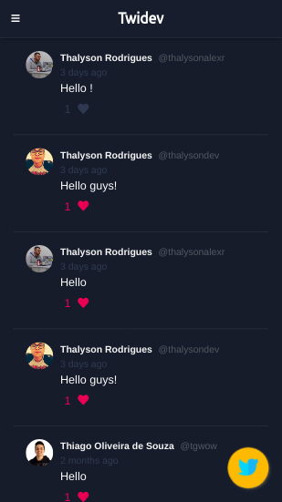
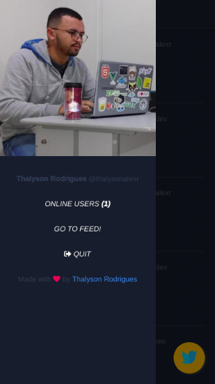
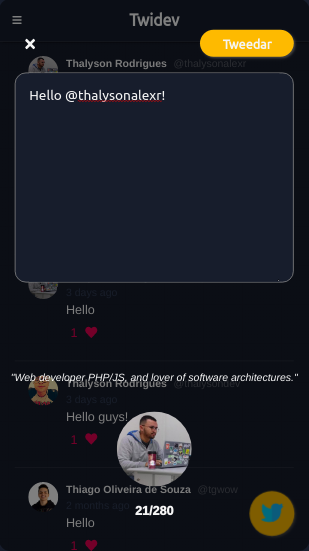
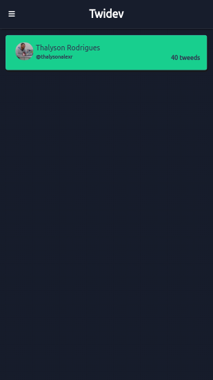

<h1 align="center">Twidev</h1>
<p align="center">Mini Twitter para Desenvolvedores do Github construído com Vue.js, Materialize, NodeJS, MongoDB, Heroku Cloud e Socket.io.:heavy_check_mark:</p>

<div align="center">

[](https://github.com/thalysonalexr/twidev-frontend/tags)
[](https://github.com/thalysonalexr)
[](https://github.com/thalysonalexr/twidev-frontend/commits)
[](https://github.com/thalysonalexr/twidev-frontend/blob/master/LICENSE)
</div>

## :information_source: Sobre o projeto

Este projeto tem como proposta ser um Mini Twitter para desenvolvedores do Github. O requisito para ser usuário desta aplicação é ter uma conta no [**Github**](https://github.com/) para fazer login na aplicação através do fluxo **Oauth2**. O projeto como todo é simples, mas utiliza de diversas tecnologias como: nodejs, vue.js, express, socket.io, github oauth2, mongodb e heroku cloud [...]. O layout foi construído com Materialize e inspirado no tema Dark do twitter com cores em amarelo.

<div align="center">

  

  

  

  

</div>

## :rocket: Como instalar e executar?

Muito simples, vamos lá:

```bash
# clone o repo
$ git clone https://github.com/thalysonalexr/twidev-frontend.git

# vá até o diretório
$ cd twidev-frontend

# instale as dependências
$ yarn install

# execute
$ yarn start
```

> Nota: este repo consome da API feita em NodeJS, portanto você deve clonar e executar primeiramente a API do projeto Twidev.

Acesse o repo da API [clicando aqui](https://github.com/thalysonalexr/twidev-backend).

## :thinking: Como contribuir?

- Faça um fork do projeto;
- Crie um branch com sua feature: `git checkout -b my-feature`;
- Faça commit das adições/alterações: `git commit -m 'feat: My new feature'`;
- Faça um push para seu branch: `git push -u origin my-feature`;
- Abra uma solicitação pull request para o repo original :heart:.

## :memo: Licença

Lançado em 2020. Este projeto está sob a [**licença MIT**](https://github.com/thalysonalexr/twidev-frontend/blob/master/LICENSE)

Desenvolvido com :heartbeat: por [**Thalyson Rodrigues**](https://www.linkedin.com/in/thalysonrodrigues/)
